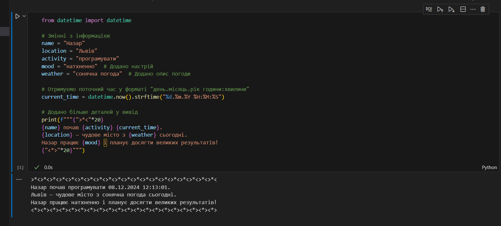

# Звіт до першої лабораторної
## Тема: перша програма на мові *Python*

### Виконання роботи
- Результати виконання завдання:
    1. Виконали першу програму, результат виконання: ;
    1. Модифікували програму та використали [Python Notebook для її виконання](lab1.ipynb);
    
    
    
    1. Програма вивела значення
    1. Отримано наступні результати: 
    >*<>*<>*<>*<>*<>*<>*<>*<>*<>*<>*<>*<>*<>*<>*<>*<>*<>*<>*<>*<
Назар почав програмувати 08.12.2024 12:12:24.
Львів — чудове місто з сонячна погода сьогодні.
Назар працює натхненно і планує досягти великих результатів!
<*><*><*><*><*><*><*><*><*><*><*><*><*><*><*><*><*><*><*><*>
    5. Навчились прості програми на мові Python


___


```Python
from datetime import datetime

# Змінні з інформацією
name = "Назар"
location = "Львів"
activity = "програмувати"
mood = "натхненно"  # Додано настрій
weather = "сонячна погода"  # Додано опис погоди

# Отримуємо поточний час у форматі "день.місяць.рік години:хвилини"
current_time = datetime.now().strftime("%d.%m.%Y %H:%M:%S")

# Додано більше деталей у вивід
print(f"""{">*<"*20}
{name} почав {activity} {current_time}. 
{location} — чудове місто з {weather} сьогодні. 
Назар працює {mood} і планує досягти великих результатів!
{"<*>"*20}""")


```
